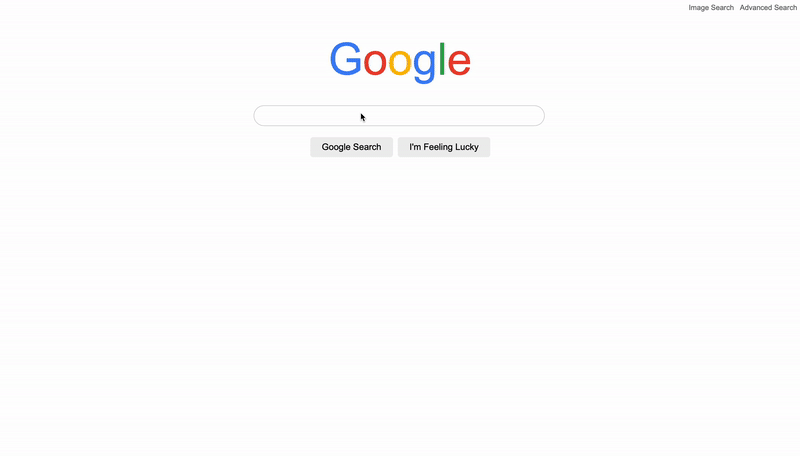
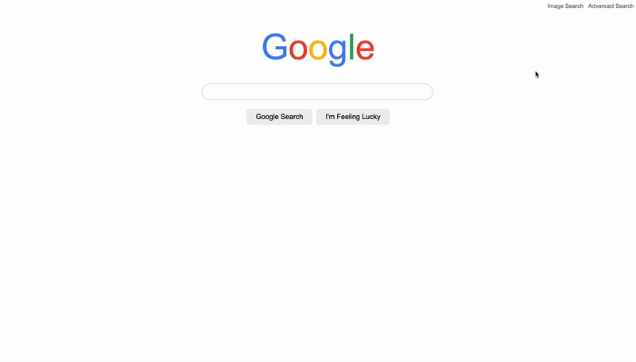
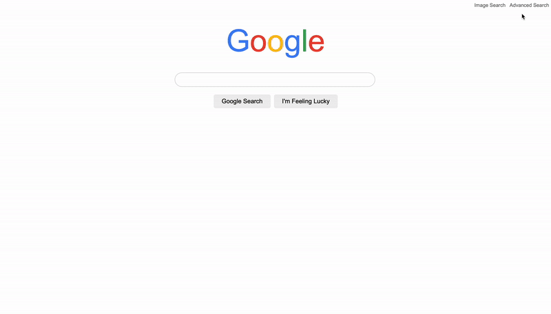
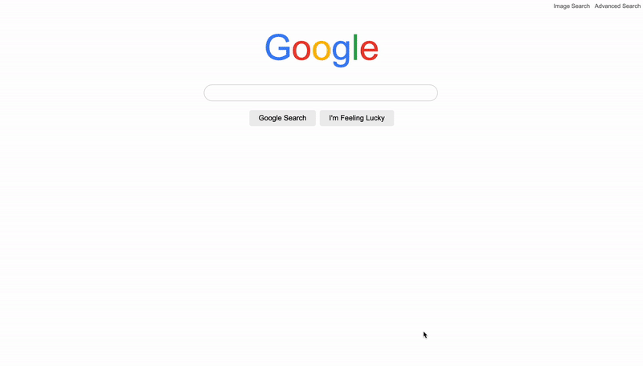

Project 0: Search

## Table of contents
- [Introduction](#introduction)
  - [Description and requirements](#description-and-requirements)
  - [Set up and installation](#set-up-and-installation)
  - [Preview](#preview)
    - [Google Search](#google-search)
    - [Image Search](#image-search)
    - [Advanced Search](#advanced-search)
    - [I'm Feeling Lucky](#im-feeling-lucky)
- [Implementation](#implementation)
  - [views](#views)
    - [index](#index)
    - [image](#image)
    - [advanced](#advanced)
  - [styling](#styling)
    - [stylesheet](#stylesheet)

# Introduction

## Description and requirements
  
Using HTML and CSS, design a front-end for Google Search, Google Image Search, and Google Advanced Search.

All requirements can be viewed at the [CS50's Search](https://cs50.harvard.edu/web/2020/projects/0/search/)

## Set up and installation
To set up this project:
1. Clone the project.
2. Open <code>index.html</code> with your browser

## Preview
### Google Search

### Image Search

### Advanced Search

### I'm Feeling Lucky

# Implementation
## views

### [index](index.html)
Here you can:
- Type in a keyword and google it, just like on Google's homepage

Components:
- Mode navigation: navigating between normal search, image search, and advanced search
- Google's logo: locates in the center of the page, right above the search box
- Search box: redirect user to google search's result page with parameter <code>q=keyword</code>
- Buttons: "Google Search" button for normal googling and "I'm Feeling Lucky" button for redirecting right to the first result's page

### [image](html/image.html)
Here you can:
- Type in a keyword and search for related images.

Components:
- Mode navigation: navigate back to normal Google's search
- Google image's logo: mimics the Google image's logo, locates in the center of the page
- Search box: reditect user to google image's result page (https://google.com/images) with parameter <code>q=keyword</code>
- Image Search button: for submitting input to Google Image search

### [advanced](html/advanced.html)
Here you can:
- Make an Advanced Search on Google.
- Fields user can provide include:
  - "all these words" (will appear in search box as: keyword)
  - "this exact word or phrase" (will appear in search box as: "keyword")
  - "any of these words" (will appear in search box as: keyword1 OR keyword2)
  - "none of these words" (will appear in search box as: -keyword)

Components:
- Mode navigation: navigate back to normal Google's search
- Google's logo: smaller than the upper-mentioned two pages, locates at the top right of the page
- Advanced Search's ext banner: locates below the navigation bar, just to remind the user that they are currently in Advanced Search mode
- Search boxes: allow the user to type in keywords fir the following four fields
  - "all these words" redirect with parameter <code>as_q=keyword</code>
  - "this exact word or phrase" redirect with parameter <code>as_epq=keyword</code>
  - "any of these words" redirect with parameter <code>as_oq=keyword</code>
  - "none of these words" redirect with parameter <code>as_eq=keyword</code>
- Advanced Search button: for submitting inputs to Google Advanced search

## styling

### [stylesheet](css/style.css)
#### Google's search box (.search_area)
Mimics real Google's search box by setting border-radius to make the box's corners rounded.

#### Google's logo colors (.GGblue, .GGred, .GGyellow, .GGgreen)
Mimics real Google's logo by using the same color codes
- blue: #4285F4
- red: #EA4335
- yellow: #FBBC05
- green: #34A853

#### Navigation 
Align all navigation buttons to the top right of the all pages. Mimics real Google's navigation button by setting the text's (buttons') color to <code>dimgray</code>.

#### Buttons
Rounded corners. Buttons styles changed when hovered:
- gray buttons ("Google Search", "Image Search", "I'm Feeling Lucky"): border appears when hovered
- blue buttons ("Advanced Search"): background color gers darker when button is hovered
