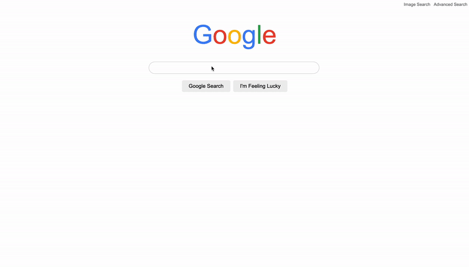

# CS50 - Project 0: Search

## Table of contents

## Introduction

### Description and requirements
Using HTML and CSS, design a front-end for Google Search, Google Image Search, and Google Advanced Search.

All requirements can be viewed at the [CS50's Search](https://cs50.harvard.edu/web/2020/projects/0/search/)

### Set up and installation
To set up this project:
1. Clone the project.
2. Open <code>index.html</code> with your browser

### Preview
#### Google Search

#### Image Search

#### Advanced Search

#### I'm Feeling Lucky

## Implementation
